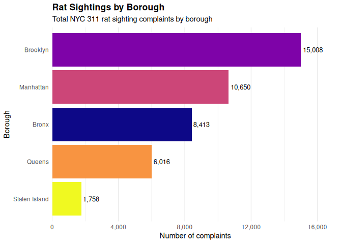
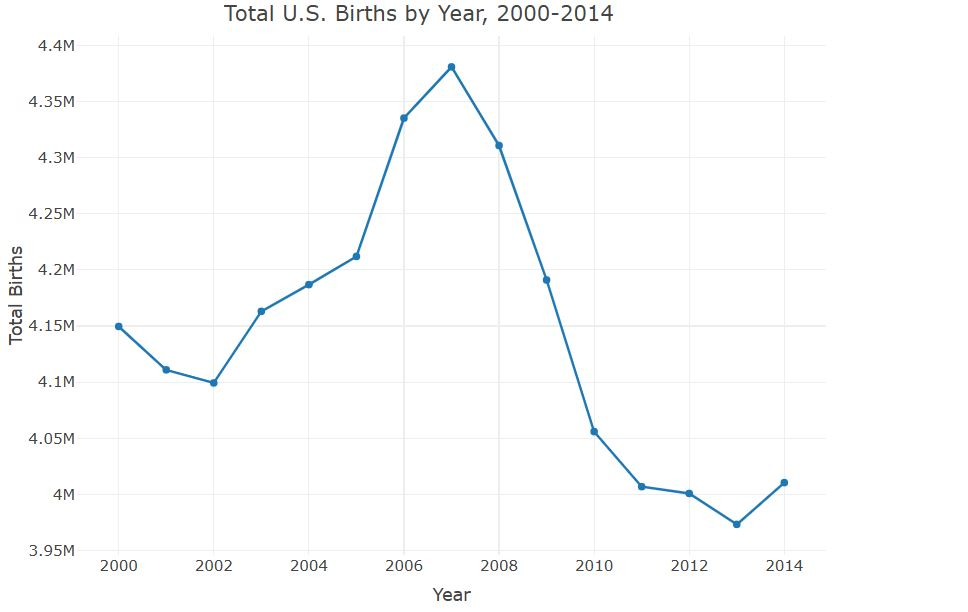
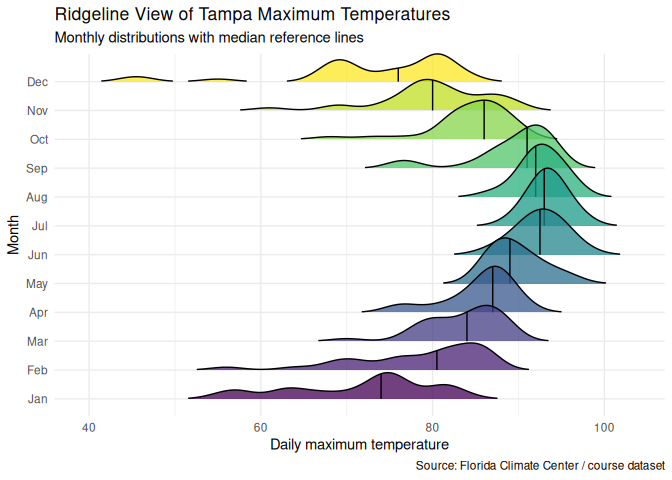

# Data Visualization and Reproducible Research

> Sukhadevsingh Jogindrasingh Virdee. 

This repository contains the final projects completed for the **Data Visualization and Reproducible Research** course. The projects demonstrate a variety of visualization techniques using R and R Markdown while emphasizing reproducible research, effective storytelling, accessibility, and interactive graphics. Throughout the semester I learned how to transform raw datasets into meaningful visualizations and communicate insights using modern data visualization principles.

---

## Project 01 – NYC Rat Sighting Analysis

The first project explores the **New York City 311 Rat Sightings** dataset. The objective was to identify patterns in reported rat sightings across boroughs, months, and days of the week. The project applies exploratory data analysis and multiple visualization techniques to highlight geographic and temporal trends. Interactive graphics, accessibility improvements, and clear annotations were incorporated to improve interpretation and usability.

**Dataset:** NYC 311 Rat Sighting Complaints

**Favorite Visualization:** Borough comparison of reported rat sightings.

---

## Project 02 – United States Birth Trends (2000–2014)

The second project analyzes daily birth records in the United States between **2000 and 2014**. The analysis investigates long-term birth trends, differences across weekdays, and annual variation using descriptive, statistical, and interactive visualizations. The project includes an interactive Plotly chart, regression analysis, and accessibility enhancements to provide a comprehensive exploration of birth patterns.

**Dataset:** U.S. Births 2000–2014

**Favorite Visualization:** Interactive time-series visualization of annual birth trends.

---

## Project 03 – Advanced Data Visualization Techniques

The third project focuses on applying advanced visualization techniques learned throughout the course. Using Tampa weather data and spatial datasets, this project demonstrates density plots, faceted visualizations, ridgeline plots, interactive graphics, accessibility improvements, and redesign of an ineffective chart. The project emphasizes reproducible workflows, thoughtful design choices, and effective visual communication.

**Datasets:** Tampa Weather 2022 and course spatial datasets

**Favorite Visualization:** Ridgeline visualization showing monthly distributions of daily maximum temperatures.

---

## Accessibility and Interactive Features

The final project incorporates several best practices introduced during the course:

* Interactive visualizations created using Plotly.
* Colorblind-friendly color palettes using the **viridis** package.
* Alternative text (`fig.alt`) provided for figures to improve accessibility.
* Improved chart annotations and labeling to enhance storytelling.
* A redesigned chart demonstrating improved visualization principles.

---

## Moving Forward

This course significantly improved my understanding of data visualization, reproducible research, and data storytelling. I learned how to create effective graphics using **ggplot2**, build interactive visualizations with **Plotly**, work with spatial data, and organize complete analytical reports using **R Markdown**. I also gained experience applying visualization design principles, improving accessibility, and communicating analytical findings through clear narratives. Going forward, I plan to continue developing my skills in interactive dashboards, geospatial visualization, statistical graphics, and reproducible data science workflows using R.
