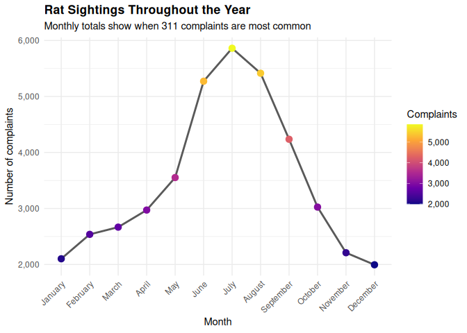
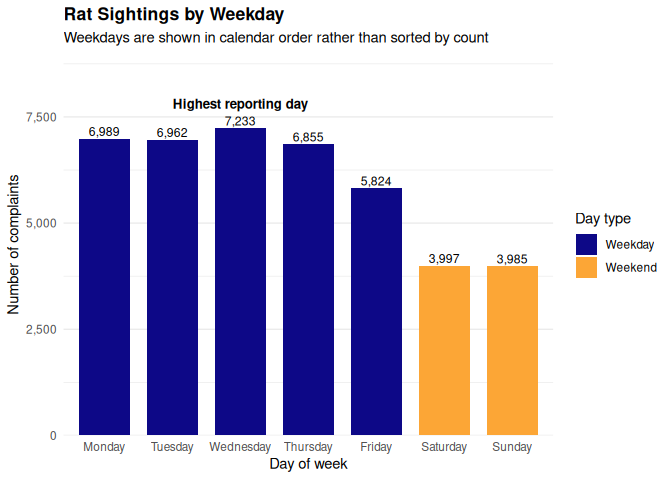
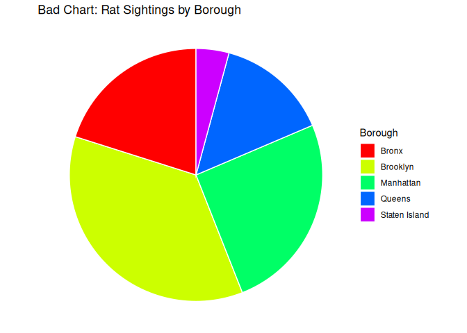
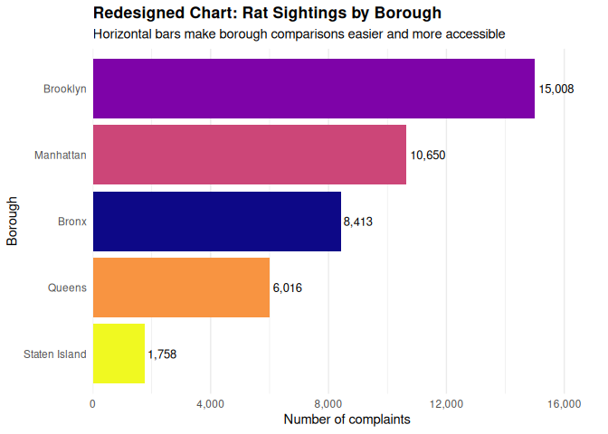

# Introduction

This revised mini-project analyzes New York City 311 rat sighting complaints. Rat sighting reports are useful for understanding how urban public health concerns vary across place and time. Because 311 complaints include temporal and geographic information, the data can be used to examine which boroughs report the most sightings, how complaints change across the year, and whether reporting patterns differ by day of the week.

The goal of this report is not to prove what causes rat activity, but to use visualization to communicate important reporting patterns in the dataset. The report includes static and interactive visualizations, accessible color choices, alt text, and a before/after chart redesign to demonstrate stronger data visualization design.

# Load Libraries


``` r
library(tidyverse)
library(readr)
library(lubridate)
library(plotly)
library(htmlwidgets)
library(viridis)

knitr::opts_chunk$set(
  echo = TRUE,
  message = FALSE,
  warning = FALSE
)
```

# Load and Prepare Data


``` r
# Preferred path when the file is included in the project data folder.
local_file <- "../data/rats_nyc.csv"

# Backup online source used only if the local file is not present.
# The local file should be included in the submitted repository when possible.
remote_file <- "https://raw.githubusercontent.com/reisanar/datasets/master/rats_nyc.csv"

if (file.exists(local_file)) {
  rats <- read_csv(local_file, show_col_types = FALSE)
} else {
  rats <- read_csv(remote_file, show_col_types = FALSE)
}

rats <- rats %>%
  mutate(
    borough = str_to_title(borough),
    borough = na_if(borough, "Unspecified"),
    sighting_month = as.integer(sighting_month),
    sighting_weekday = factor(
      sighting_weekday,
      levels = c("Monday", "Tuesday", "Wednesday", "Thursday", "Friday", "Saturday", "Sunday")
    ),
    month_name = factor(
      month.name[sighting_month],
      levels = month.name
    )
  ) %>%
  filter(!is.na(borough), !is.na(sighting_month), !is.na(sighting_weekday))
```

# Dataset Description

The NYC rat sighting dataset contains public 311 service complaints related to reported rat sightings. Each row represents a complaint record, and the dataset includes variables such as borough, city, incident ZIP code, location type, complaint status, and date-based variables such as year, month, day, and weekday.

For this revised report, the analysis focuses on three main questions:

1. Which boroughs report the most rat sightings?
2. How do reports vary across months of the year?
3. Are there differences in reports across weekdays and weekends?


``` r
rats %>%
  summarise(
    observations = n(),
    boroughs = n_distinct(borough),
    years = n_distinct(sighting_year),
    months = n_distinct(sighting_month)
  )
```

<div data-pagedtable="false">
  <script data-pagedtable-source type="application/json">
{"columns":[{"label":["observations"],"name":[1],"type":["int"],"align":["right"]},{"label":["boroughs"],"name":[2],"type":["int"],"align":["right"]},{"label":["years"],"name":[3],"type":["int"],"align":["right"]},{"label":["months"],"name":[4],"type":["int"],"align":["right"]}],"data":[{"1":"41845","2":"5","3":"3","4":"12"}],"options":{"columns":{"min":{},"max":[10]},"rows":{"min":[10],"max":[10]},"pages":{}}}
  </script>
</div>
# Visualization 1: Rat Sightings by Borough


``` r
borough_summary <- rats %>%
  count(borough, sort = TRUE)
```


``` r
borough_plot <- ggplot(
  borough_summary,
  aes(x = reorder(borough, n), y = n, fill = borough)
) +
  geom_col(show.legend = FALSE) +
  geom_text(aes(label = scales::comma(n)), hjust = -0.1, size = 3.4) +
  coord_flip() +
  scale_fill_viridis_d(option = "C") +
  scale_y_continuous(labels = scales::comma, expand = expansion(mult = c(0, 0.15))) +
  labs(
    title = "Rat Sightings by Borough",
    subtitle = "Total NYC 311 rat sighting complaints by borough",
    x = "Borough",
    y = "Number of complaints"
  ) +
  theme_minimal() +
  theme(
    plot.title = element_text(face = "bold"),
    panel.grid.major.y = element_blank()
  )

borough_plot
```


### Interpretation

This chart shows that rat sighting complaints are not evenly distributed across New York City boroughs. The borough with the largest number of reports stands out clearly, while other boroughs have lower totals. This does not prove that one borough has more rats than another because 311 data also reflects population size, reporting behavior, and public awareness. However, it does show where reported complaints are concentrated.

# Interactive Chart


``` r
interactive_borough <- ggplotly(
  borough_plot,
  tooltip = c("x", "y")
) %>%
  layout(title = list(text = "Interactive Rat Sightings by Borough"))

interactive_borough
```

```{=html}
<div class="plotly html-widget html-fill-item" id="htmlwidget-0fb69f09e3eb72aaa190" style="width:672px;height:480px;"></div>
<script type="application/json" data-for="htmlwidget-0fb69f09e3eb72aaa190">{"x":{"data":[{"orientation":"h","width":0.90000000000000036,"base":0,"x":[8413],"y":[3],"text":"reorder(borough, n): Bronx<br />n:  8413","type":"bar","textposition":"none","marker":{"autocolorscale":false,"color":"rgba(13,8,135,1)","line":{"width":1.8897637795275593,"color":"transparent"}},"name":"Bronx","legendgroup":"Bronx","showlegend":true,"xaxis":"x","yaxis":"y","hoverinfo":"text","frame":null},{"orientation":"h","width":0.90000000000000036,"base":0,"x":[15008],"y":[5],"text":"reorder(borough, n): Brooklyn<br />n: 15008","type":"bar","textposition":"none","marker":{"autocolorscale":false,"color":"rgba(126,3,168,1)","line":{"width":1.8897637795275593,"color":"transparent"}},"name":"Brooklyn","legendgroup":"Brooklyn","showlegend":true,"xaxis":"x","yaxis":"y","hoverinfo":"text","frame":null},{"orientation":"h","width":0.90000000000000036,"base":0,"x":[10650],"y":[4],"text":"reorder(borough, n): Manhattan<br />n: 10650","type":"bar","textposition":"none","marker":{"autocolorscale":false,"color":"rgba(204,70,120,1)","line":{"width":1.8897637795275593,"color":"transparent"}},"name":"Manhattan","legendgroup":"Manhattan","showlegend":true,"xaxis":"x","yaxis":"y","hoverinfo":"text","frame":null},{"orientation":"h","width":0.90000000000000013,"base":0,"x":[6016],"y":[2],"text":"reorder(borough, n): Queens<br />n:  6016","type":"bar","textposition":"none","marker":{"autocolorscale":false,"color":"rgba(248,148,65,1)","line":{"width":1.8897637795275593,"color":"transparent"}},"name":"Queens","legendgroup":"Queens","showlegend":true,"xaxis":"x","yaxis":"y","hoverinfo":"text","frame":null},{"orientation":"h","width":0.89999999999999991,"base":0,"x":[1758],"y":[1],"text":"reorder(borough, n): Staten Island<br />n:  1758","type":"bar","textposition":"none","marker":{"autocolorscale":false,"color":"rgba(240,249,33,1)","line":{"width":1.8897637795275593,"color":"transparent"}},"name":"Staten Island","legendgroup":"Staten Island","showlegend":true,"xaxis":"x","yaxis":"y","hoverinfo":"text","frame":null},{"x":[8413],"y":[3],"text":"8,413","hovertext":"reorder(borough, n): Bronx<br />n:  8413","textfont":{"size":12.850393700787402,"color":"rgba(0,0,0,1)"},"type":"scatter","mode":"text","hoveron":"points","name":"Bronx","legendgroup":"Bronx","showlegend":false,"xaxis":"x","yaxis":"y","hoverinfo":"text","frame":null},{"x":[15008],"y":[5],"text":"15,008","hovertext":"reorder(borough, n): Brooklyn<br />n: 15008","textfont":{"size":12.850393700787402,"color":"rgba(0,0,0,1)"},"type":"scatter","mode":"text","hoveron":"points","name":"Brooklyn","legendgroup":"Brooklyn","showlegend":false,"xaxis":"x","yaxis":"y","hoverinfo":"text","frame":null},{"x":[10650],"y":[4],"text":"10,650","hovertext":"reorder(borough, n): Manhattan<br />n: 10650","textfont":{"size":12.850393700787402,"color":"rgba(0,0,0,1)"},"type":"scatter","mode":"text","hoveron":"points","name":"Manhattan","legendgroup":"Manhattan","showlegend":false,"xaxis":"x","yaxis":"y","hoverinfo":"text","frame":null},{"x":[6016],"y":[2],"text":"6,016","hovertext":"reorder(borough, n): Queens<br />n:  6016","textfont":{"size":12.850393700787402,"color":"rgba(0,0,0,1)"},"type":"scatter","mode":"text","hoveron":"points","name":"Queens","legendgroup":"Queens","showlegend":false,"xaxis":"x","yaxis":"y","hoverinfo":"text","frame":null},{"x":[1758],"y":[1],"text":"1,758","hovertext":"reorder(borough, n): Staten Island<br />n:  1758","textfont":{"size":12.850393700787402,"color":"rgba(0,0,0,1)"},"type":"scatter","mode":"text","hoveron":"points","name":"Staten Island","legendgroup":"Staten Island","showlegend":false,"xaxis":"x","yaxis":"y","hoverinfo":"text","frame":null}],"layout":{"margin":{"t":40.840182648401829,"r":7.3059360730593621,"b":37.260273972602747,"l":101.55251141552515},"paper_bgcolor":"rgba(255,255,255,1)","font":{"color":"rgba(0,0,0,1)","family":"","size":14.611872146118724},"title":{"text":"Interactive Rat Sightings by Borough","font":{"color":"rgba(0,0,0,1)","family":"","size":17.534246575342465},"x":0,"xref":"paper"},"xaxis":{"domain":[0,1],"automargin":true,"type":"linear","autorange":false,"range":[0,17259.200000000001],"tickmode":"array","ticktext":["0","4,000","8,000","12,000","16,000"],"tickvals":[0,4000,8000,12000,16000],"categoryorder":"array","categoryarray":["0","4,000","8,000","12,000","16,000"],"nticks":null,"ticks":"","tickcolor":null,"ticklen":3.6529680365296811,"tickwidth":0,"showticklabels":true,"tickfont":{"color":"rgba(77,77,77,1)","family":"","size":11.68949771689498},"tickangle":-0,"showline":false,"linecolor":null,"linewidth":0,"showgrid":true,"gridcolor":"rgba(235,235,235,1)","gridwidth":0.66417600664176002,"zeroline":false,"anchor":"y","title":{"text":"Number of complaints","font":{"color":"rgba(0,0,0,1)","family":"","size":14.611872146118724}},"hoverformat":".2f"},"yaxis":{"domain":[0,1],"automargin":true,"type":"linear","autorange":false,"range":[0.40000000000000002,5.5999999999999996],"tickmode":"array","ticktext":["Staten Island","Queens","Bronx","Manhattan","Brooklyn"],"tickvals":[1,2,3,4,5],"categoryorder":"array","categoryarray":["Staten Island","Queens","Bronx","Manhattan","Brooklyn"],"nticks":null,"ticks":"","tickcolor":null,"ticklen":3.6529680365296811,"tickwidth":0,"showticklabels":true,"tickfont":{"color":"rgba(77,77,77,1)","family":"","size":11.68949771689498},"tickangle":-0,"showline":false,"linecolor":null,"linewidth":0,"showgrid":false,"gridcolor":null,"gridwidth":0,"zeroline":false,"anchor":"x","title":{"text":"Borough","font":{"color":"rgba(0,0,0,1)","family":"","size":14.611872146118724}},"hoverformat":".2f"},"shapes":[],"showlegend":true,"legend":{"bgcolor":null,"bordercolor":null,"borderwidth":0,"font":{"color":"rgba(0,0,0,1)","family":"","size":11.68949771689498},"title":{"text":"","font":{"color":"rgba(0,0,0,1)","family":"","size":14.611872146118724}}},"hovermode":"closest","barmode":"relative"},"config":{"doubleClick":"reset","modeBarButtonsToAdd":["hoverclosest","hovercompare"],"showSendToCloud":false},"source":"A","attrs":{"18006bf36890":{"x":{},"y":{},"fill":{},"type":"bar"},"18004dd2f4a4":{"x":{},"y":{},"fill":{},"label":{}}},"cur_data":"18006bf36890","visdat":{"18006bf36890":["function (y) ","x"],"18004dd2f4a4":["function (y) ","x"]},"highlight":{"on":"plotly_click","persistent":false,"dynamic":false,"selectize":false,"opacityDim":0.20000000000000001,"selected":{"opacity":1},"debounce":0},"shinyEvents":["plotly_hover","plotly_click","plotly_selected","plotly_relayout","plotly_brushed","plotly_brushing","plotly_clickannotation","plotly_doubleclick","plotly_deselect","plotly_afterplot","plotly_sunburstclick"],"base_url":"https://plot.ly"},"evals":[],"jsHooks":[]}</script>
```


``` r
# Run this chunk if you want a separate self-contained HTML widget file.
saveWidget(
  interactive_borough,
  file = "rat_sightings_by_borough_interactive.html",
  selfcontained = TRUE
)
```

### Why the Interactive Chart Helps

The interactive version allows readers to hover over the chart and inspect exact complaint totals by borough. This improves the static chart by making the values easier to explore without adding too many labels or clutter to the figure.

# Visualization 2: Rat Sightings by Month


``` r
monthly_summary <- rats %>%
  count(month_name) %>%
  mutate(month_number = as.integer(month_name))
```


``` r
ggplot(monthly_summary, aes(x = month_name, y = n, group = 1)) +
  geom_line(linewidth = 1, color = "gray35") +
  geom_point(aes(color = n), size = 3) +
  scale_color_viridis_c(option = "C", labels = scales::comma) +
  scale_y_continuous(labels = scales::comma) +
  labs(
    title = "Rat Sightings Throughout the Year",
    subtitle = "Monthly totals show when 311 complaints are most common",
    x = "Month",
    y = "Number of complaints",
    color = "Complaints"
  ) +
  theme_minimal() +
  theme(
    plot.title = element_text(face = "bold"),
    axis.text.x = element_text(angle = 45, hjust = 1)
  )
```



### Interpretation

The monthly pattern suggests that rat sighting complaints vary across the year. Some months have noticeably higher report totals than others, which may reflect seasonal patterns, changes in outdoor activity, or differences in when residents are more likely to report sightings. Because this dataset does not include weather, sanitation, or construction variables, the chart should be interpreted as a pattern in reported complaints rather than direct evidence of the causes of rat activity.

# Visualization 3: Rat Sightings by Weekday


``` r
weekday_summary <- rats %>%
  count(sighting_weekday) %>%
  mutate(day_type = if_else(sighting_weekday %in% c("Saturday", "Sunday"), "Weekend", "Weekday"))

highest_weekday <- weekday_summary %>%
  slice_max(n, n = 1)
```


``` r
ggplot(
  weekday_summary,
  aes(x = sighting_weekday, y = n, fill = day_type)
) +
  geom_col(width = 0.75) +
  geom_text(aes(label = scales::comma(n)), vjust = -0.3, size = 3.2) +
  annotate(
    "text",
    x = highest_weekday$sighting_weekday,
    y = highest_weekday$n * 1.08,
    label = "Highest reporting day",
    size = 3.5,
    fontface = "bold"
  ) +
  scale_fill_viridis_d(option = "C", end = 0.8) +
  scale_y_continuous(labels = scales::comma, expand = expansion(mult = c(0, 0.15))) +
  labs(
    title = "Rat Sightings by Weekday",
    subtitle = "Weekdays are shown in calendar order rather than sorted by count",
    x = "Day of week",
    y = "Number of complaints",
    fill = "Day type"
  ) +
  theme_minimal() +
  theme(
    plot.title = element_text(face = "bold"),
    panel.grid.major.x = element_blank()
  )
```



### Interpretation

Ordering the days from Monday through Sunday makes the chart easier to interpret as a weekly cycle. The results show differences in complaint reporting across weekdays and weekends. These differences may reflect reporting behavior, work schedules, or actual differences in when people observe rats. The chart avoids making a causal claim because the dataset records complaints rather than direct measures of rat population.

# Bad Chart Redesign: Before and After

The final project asks for a bad or misleading chart to be redesigned. The original version below intentionally uses poor design choices: a pie chart, a rainbow palette, and labels that are difficult to compare. Pie charts can make borough comparisons harder because readers must compare angles rather than a common baseline.

## Before: Poor Chart Design


``` r
ggplot(borough_summary, aes(x = "", y = n, fill = borough)) +
  geom_col(width = 1, color = "white") +
  coord_polar(theta = "y") +
  scale_fill_manual(values = rainbow(nrow(borough_summary))) +
  labs(
    title = "Bad Chart: Rat Sightings by Borough",
    fill = "Borough"
  ) +
  theme_void()
```



## After: Improved Chart Design


``` r
ggplot(
  borough_summary,
  aes(x = reorder(borough, n), y = n, fill = borough)
) +
  geom_col(show.legend = FALSE) +
  coord_flip() +
  geom_text(aes(label = scales::comma(n)), hjust = -0.1, size = 3.4) +
  scale_fill_viridis_d(option = "C") +
  scale_y_continuous(labels = scales::comma, expand = expansion(mult = c(0, 0.15))) +
  labs(
    title = "Redesigned Chart: Rat Sightings by Borough",
    subtitle = "Horizontal bars make borough comparisons easier and more accessible",
    x = "Borough",
    y = "Number of complaints"
  ) +
  theme_minimal() +
  theme(
    plot.title = element_text(face = "bold"),
    panel.grid.major.y = element_blank()
  )
```



### Redesign Explanation

The redesigned chart improves the original by replacing the pie chart with a horizontal bar chart. A bar chart uses a common baseline, making the borough totals easier to compare. The improved version also uses a colorblind-safe viridis palette, direct value labels, clear axis labels, and a cleaner theme. These changes reduce chartjunk and make the visualization more readable and accessible.

# Accessibility and Design Notes

This report uses `fig.alt` descriptions for figures so that the visual content is more accessible. It also uses viridis color palettes, which are more readable for viewers with common forms of color vision deficiency. When possible, the charts avoid relying only on color by also using labels, position, and ordering to communicate meaning.

# Story Told by the Data

The data shows that NYC rat sighting complaints vary by borough, month, and day of week. Borough-level totals reveal that complaints are concentrated unevenly across the city. Monthly totals suggest that reporting patterns fluctuate throughout the year. Weekday patterns show that reports are not distributed equally across the week, but these patterns should be interpreted carefully because 311 complaints reflect public reporting behavior as well as actual sightings.

# Conclusion

This revised analysis demonstrates how data visualization can communicate meaningful patterns in public service complaint data. The strongest finding is that rat sighting complaints are unevenly distributed across boroughs, suggesting that geographic context is important when interpreting 311 records. The monthly and weekday charts show additional temporal variation, but the dataset does not include enough explanatory variables to confirm causes such as weather, sanitation, or population density. The interactive chart, accessible palettes, alt text, and chart redesign strengthen the final report by improving both usability and storytelling.
