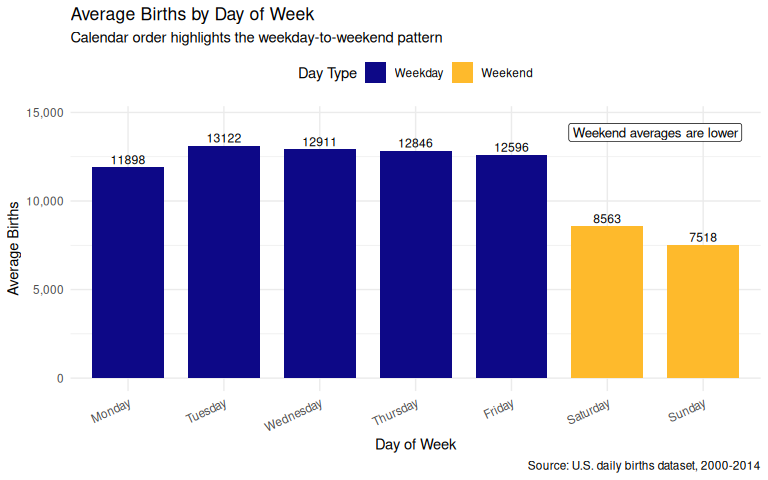
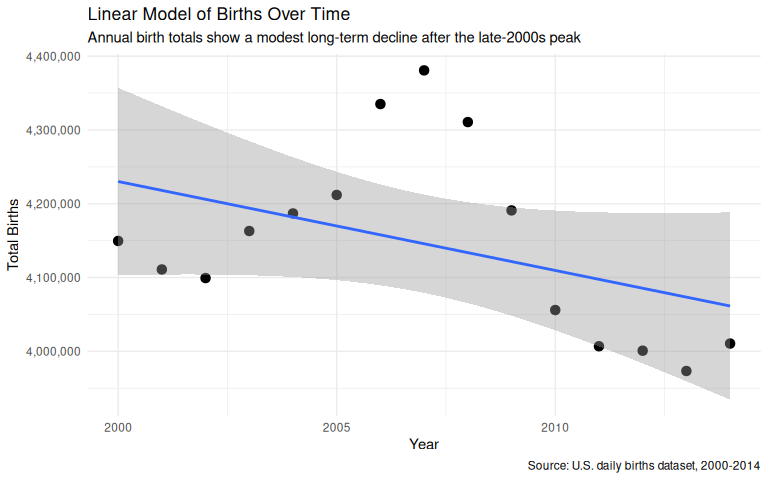
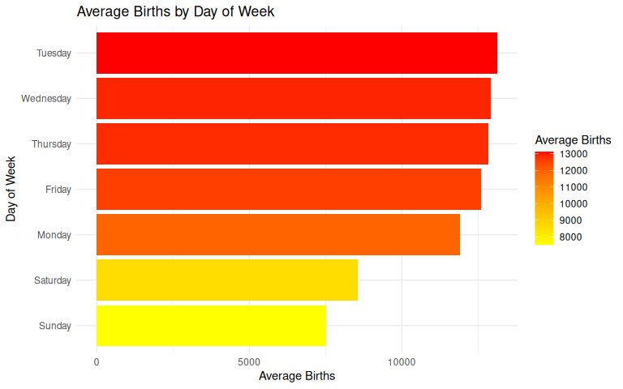
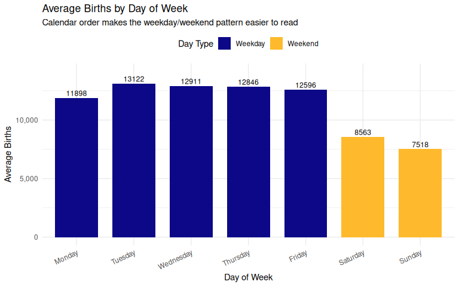

This revised mini-project 2 analyzes daily birth records in the United States from 2000 through 2014. The main goal is to understand how birth activity changed over time and how births varied across days of the week. This version improves the original report by adding an interactive chart, using accessible visual design choices, ordering weekdays in calendar order, adding a callout annotation, and including a before/after chart redesign.

# Introduction

## Motivation

Birth patterns provide valuable insight into demographic trends, healthcare practices, and population changes in the United States. Understanding how birth counts vary over time and across different days of the week can reveal important patterns in human behavior and healthcare scheduling. This project analyzes daily birth records in the United States from 2000 through 2014 to explore long-term trends and identify factors that may influence birth frequency.

Rather than focusing solely on overall birth totals, this analysis investigates whether births are distributed evenly throughout the week and whether birth counts changed over the fifteen-year study period. The project combines interactive, descriptive, and model-based visualizations to communicate these patterns and provide a clearer understanding of the data.

## Dataset Description

The dataset contains daily birth records in the United States between 2000 and 2014. Each observation represents the number of births recorded on a specific day. The dataset includes information about the year, month, date, day of the week, and total number of births.

The primary variables used in this analysis are:

- **year**: calendar year of observation
- **month**: month of observation
- **date_of_month**: day of the month
- **day_of_week**: weekday associated with each observation
- **births**: total births recorded on that day

The dataset provides an opportunity to explore temporal patterns in birth activity and examine how birth counts vary across different time scales.

## Data Preparation


``` r
library(tidyverse)
library(plotly)
library(lubridate)
library(broom)
library(htmlwidgets)

knitr::opts_chunk$set(
  message = FALSE,
  warning = FALSE,
  fig.align = "center"
)
```

Reading CSV file

``` r
births <- read_csv("../data/us_births_00_14.csv")

births <- births %>%
  mutate(
    date = as.Date(date),
    day_of_week = recode(day_of_week,
                         "Mon" = "Monday",
                         "Tues" = "Tuesday",
                         "Wed" = "Wednesday",
                         "Thurs" = "Thursday",
                         "Fri" = "Friday",
                         "Sat" = "Saturday",
                         "Sun" = "Sunday"),
    day_of_week = factor(day_of_week,
                         levels = c("Monday", "Tuesday", "Wednesday", "Thursday", "Friday", "Saturday", "Sunday")),
    day_type = if_else(day_of_week %in% c("Saturday", "Sunday"), "Weekend", "Weekday")
  )

head(births)
```

<div data-pagedtable="false">
  <script data-pagedtable-source type="application/json">
{"columns":[{"label":["year"],"name":[1],"type":["dbl"],"align":["right"]},{"label":["month"],"name":[2],"type":["dbl"],"align":["right"]},{"label":["date_of_month"],"name":[3],"type":["dbl"],"align":["right"]},{"label":["date"],"name":[4],"type":["date"],"align":["right"]},{"label":["day_of_week"],"name":[5],"type":["fct"],"align":["left"]},{"label":["births"],"name":[6],"type":["dbl"],"align":["right"]},{"label":["day_type"],"name":[7],"type":["chr"],"align":["left"]}],"data":[{"1":"2000","2":"1","3":"1","4":"2000-01-01","5":"Saturday","6":"9083","7":"Weekend"},{"1":"2000","2":"1","3":"2","4":"2000-01-02","5":"Sunday","6":"8006","7":"Weekend"},{"1":"2000","2":"1","3":"3","4":"2000-01-03","5":"Monday","6":"11363","7":"Weekday"},{"1":"2000","2":"1","3":"4","4":"2000-01-04","5":"Tuesday","6":"13032","7":"Weekday"},{"1":"2000","2":"1","3":"5","4":"2000-01-05","5":"Wednesday","6":"12558","7":"Weekday"},{"1":"2000","2":"1","3":"6","4":"2000-01-06","5":"Thursday","6":"12466","7":"Weekday"}],"options":{"columns":{"min":{},"max":[10]},"rows":{"min":[10],"max":[10]},"pages":{}}}
  </script>
</div>


``` r
glimpse(births)
```

```
## Rows: 5,479
## Columns: 7
## $ year          <dbl> 2000, 2000, 2000, 2000, 2000, 2000, 2000, 2000, 2000, 20…
## $ month         <dbl> 1, 1, 1, 1, 1, 1, 1, 1, 1, 1, 1, 1, 1, 1, 1, 1, 1, 1, 1,…
## $ date_of_month <dbl> 1, 2, 3, 4, 5, 6, 7, 8, 9, 10, 11, 12, 13, 14, 15, 16, 1…
## $ date          <date> 2000-01-01, 2000-01-02, 2000-01-03, 2000-01-04, 2000-01…
## $ day_of_week   <fct> Saturday, Sunday, Monday, Tuesday, Wednesday, Thursday, …
## $ births        <dbl> 9083, 8006, 11363, 13032, 12558, 12466, 12516, 8934, 794…
## $ day_type      <chr> "Weekend", "Weekend", "Weekday", "Weekday", "Weekday", "…
```


``` r
summary(births)
```

```
##       year          month        date_of_month        date           
##  Min.   :2000   Min.   : 1.000   Min.   : 1.00   Min.   :2000-01-01  
##  1st Qu.:2003   1st Qu.: 4.000   1st Qu.: 8.00   1st Qu.:2003-10-01  
##  Median :2007   Median : 7.000   Median :16.00   Median :2007-07-02  
##  Mean   :2007   Mean   : 6.523   Mean   :15.73   Mean   :2007-07-02  
##  3rd Qu.:2011   3rd Qu.:10.000   3rd Qu.:23.00   3rd Qu.:2011-04-01  
##  Max.   :2014   Max.   :12.000   Max.   :31.00   Max.   :2014-12-31  
##                                                                      
##     day_of_week      births           day_type   
##  Monday   :783   Min.   : 5728   Length   :5479  
##  Tuesday  :783   1st Qu.: 8740   N.unique :   2  
##  Wednesday:783   Median :12343   N.blank  :   0  
##  Thursday :782   Mean   :11350   Min.nchar:   7  
##  Friday   :782   3rd Qu.:13082   Max.nchar:   7  
##  Saturday :783   Max.   :16081                   
##  Sunday   :783
```

## Data Cleaning


``` r
sum(is.na(births))
```

```
## [1] 0
```

The dataset contains no significant missing values and required minimal cleaning. The main preparation step was converting the date variable to date format and recoding the weekday abbreviations into full weekday names so the day-of-week chart can be displayed in correct calendar order.

## Accessibility and Design Choices

This report uses several accessibility improvements. Static figures include `fig.alt` text in the R Markdown chunk options. The weekday visualization uses a colorblind-safe viridis palette and direct value labels so the reader does not need to rely on color alone. The improved weekday chart also uses calendar order from Monday through Sunday rather than ordering the days by average births.


## Visualization 1: Interactive Birth Trends

### Aggregate Births by Year


``` r
births_yearly <- births %>%
  group_by(year) %>%
  summarise(total_births = sum(births), .groups = "drop")
```


``` r
interactive_plot <- plot_ly(
  births_yearly,
  x = ~year,
  y = ~total_births,
  type = "scatter",
  mode = "lines+markers",
  text = ~paste0("Year: ", year,
                 "<br>Total births: ", scales::comma(total_births)),
  hoverinfo = "text"
) %>%
  layout(
    title = "Total U.S. Births by Year, 2000-2014",
    xaxis = list(title = "Year"),
    yaxis = list(title = "Total Births")
  )

interactive_plot
```

```{=html}
<div class="plotly html-widget html-fill-item" id="htmlwidget-61c6418743ceb3f97419" style="width:672px;height:480px;"></div>
<script type="application/json" data-for="htmlwidget-61c6418743ceb3f97419">{"x":{"visdat":{"e594afcf4da":["function () ","plotlyVisDat"]},"cur_data":"e594afcf4da","attrs":{"e594afcf4da":{"x":{},"y":{},"mode":"lines+markers","text":{},"hoverinfo":"text","alpha_stroke":1,"sizes":[10,100],"spans":[1,20],"type":"scatter"}},"layout":{"margin":{"b":40,"l":60,"t":25,"r":10},"title":"Total U.S. Births by Year, 2000-2014","xaxis":{"domain":[0,1],"automargin":true,"title":"Year"},"yaxis":{"domain":[0,1],"automargin":true,"title":"Total Births"},"hovermode":"closest","showlegend":false},"source":"A","config":{"modeBarButtonsToAdd":["hoverclosest","hovercompare"],"showSendToCloud":false},"data":[{"x":[2000,2001,2002,2003,2004,2005,2006,2007,2008,2009,2010,2011,2012,2013,2014],"y":[4149598,4110963,4099313,4163060,4186863,4211941,4335154,4380784,4310737,4190991,4055975,4006908,4000868,3973337,4010532],"mode":"lines+markers","text":["Year: 2000<br>Total births: 4,149,598","Year: 2001<br>Total births: 4,110,963","Year: 2002<br>Total births: 4,099,313","Year: 2003<br>Total births: 4,163,060","Year: 2004<br>Total births: 4,186,863","Year: 2005<br>Total births: 4,211,941","Year: 2006<br>Total births: 4,335,154","Year: 2007<br>Total births: 4,380,784","Year: 2008<br>Total births: 4,310,737","Year: 2009<br>Total births: 4,190,991","Year: 2010<br>Total births: 4,055,975","Year: 2011<br>Total births: 4,006,908","Year: 2012<br>Total births: 4,000,868","Year: 2013<br>Total births: 3,973,337","Year: 2014<br>Total births: 4,010,532"],"hoverinfo":["text","text","text","text","text","text","text","text","text","text","text","text","text","text","text"],"type":"scatter","marker":{"color":"rgba(31,119,180,1)","line":{"color":"rgba(31,119,180,1)"}},"error_y":{"color":"rgba(31,119,180,1)"},"error_x":{"color":"rgba(31,119,180,1)"},"line":{"color":"rgba(31,119,180,1)"},"xaxis":"x","yaxis":"y","frame":null}],"highlight":{"on":"plotly_click","persistent":false,"dynamic":false,"selectize":false,"opacityDim":0.20000000000000001,"selected":{"opacity":1},"debounce":0},"shinyEvents":["plotly_hover","plotly_click","plotly_selected","plotly_relayout","plotly_brushed","plotly_brushing","plotly_clickannotation","plotly_doubleclick","plotly_deselect","plotly_afterplot","plotly_sunburstclick"],"base_url":"https://plot.ly"},"evals":[],"jsHooks":[]}</script>
```

``` r
saveWidget(
  interactive_plot,
  file = "Virdee_Project_02_interactive_birth_trend.html",
  selfcontained = TRUE
)
```

### Findings

>The yearly birth totals reveal that birth activity remained relatively stable throughout the study period, although noticeable fluctuations are present. Some years experienced modest increases while others showed slight declines. The interactive visualization makes it possible to hover over each year and inspect the exact annual birth total, which provides more detail than a static chart alone.
>
>Although variation exists from year to year, the data do not indicate dramatic changes in national birth levels during this period. Instead, the visualization suggests a generally consistent volume of births with moderate fluctuations. The dataset does not provide enough information to determine the causes of these changes, so the results should be interpreted as descriptive patterns rather than causal evidence.

## Visualization 2: Births by Day of Week


``` r
births_day <- births %>%
  group_by(day_of_week, day_type) %>%
  summarise(avg_births = mean(births), .groups = "drop")
```


``` r
ggplot(births_day,
       aes(x = day_of_week,
           y = avg_births,
           fill = day_type)) +
  geom_col(width = 0.75) +
  geom_text(
    aes(label = round(avg_births, 0)),
    vjust = -0.35,
    size = 3.2
  ) +
  annotate(
    "label",
    x = 6.5,
    y = max(births_day$avg_births) + 750,
    label = "Weekend averages are lower",
    size = 3.5,
    label.size = 0.25
  ) +
  scale_fill_viridis_d(option = "C", end = 0.85) +
  scale_y_continuous(labels = scales::comma) +
  coord_cartesian(ylim = c(0, max(births_day$avg_births) + 1500)) +
  labs(
    title = "Average Births by Day of Week",
    subtitle = "Calendar order highlights the weekday-to-weekend pattern",
    x = "Day of Week",
    y = "Average Births",
    fill = "Day Type",
    caption = "Source: U.S. daily births dataset, 2000-2014"
  ) +
  theme_minimal() +
  theme(
    legend.position = "top",
    axis.text.x = element_text(angle = 25, hjust = 1)
  )
```



### Findings

>The average number of births differs substantially across days of the week. Weekdays generally exhibit higher average birth counts than weekends, with Saturday and Sunday consistently showing lower values. This pattern suggests that births are not distributed evenly throughout the week.
>
>One possible explanation is the scheduling of medical procedures such as induced labor or cesarean deliveries during standard working days. However, the dataset does not contain information about delivery methods, so this interpretation should be considered a reasonable hypothesis rather than a confirmed conclusion. The visualization clearly demonstrates that day-of-week effects are present and represent an important source of variation in birth activity.

## Visualization 3: Model Visualization

### Linear Regression


``` r
model <- lm(total_births ~ year, data = births_yearly)
tidy(model)
```

<div data-pagedtable="false">
  <script data-pagedtable-source type="application/json">
{"columns":[{"label":["term"],"name":[1],"type":["chr"],"align":["left"]},{"label":["estimate"],"name":[2],"type":["dbl"],"align":["right"]},{"label":["std.error"],"name":[3],"type":["dbl"],"align":["right"]},{"label":["statistic"],"name":[4],"type":["dbl"],"align":["right"]},{"label":["p.value"],"name":[5],"type":["dbl"],"align":["right"]}],"data":[{"1":"(Intercept)","2":"28337548.83","3":"14338700.211","4":"1.976298","5":"0.06973319"},{"1":"year","2":"-12053.69","3":"7144.328","4":"-1.687168","5":"0.11540341"}],"options":{"columns":{"min":{},"max":[10]},"rows":{"min":[10],"max":[10]},"pages":{}}}
  </script>
</div>


``` r
ggplot(births_yearly,
       aes(x = year,
           y = total_births)) +
  geom_point(size = 3) +
  geom_smooth(method = "lm", se = TRUE, linewidth = 1) +
  scale_y_continuous(labels = scales::comma) +
  labs(
    title = "Linear Model of Births Over Time",
    subtitle = "Annual birth totals show a modest long-term decline after the late-2000s peak",
    x = "Year",
    y = "Total Births",
    caption = "Source: U.S. daily births dataset, 2000-2014"
  ) +
  theme_minimal()
```



### Findings

>The regression model was used to examine the relationship between year and total annual births in the United States between 2000 and 2014. The fitted regression line summarizes the overall trend in birth totals and helps determine whether births generally increased, decreased, or remained stable during the study period.
>
>The visualization suggests that birth totals experienced only modest changes over time, with no evidence of dramatic long-term growth or decline. While annual birth counts fluctuate from year to year, the regression line indicates that these changes occur within a relatively narrow range compared to the overall number of births recorded each year.
>
>The confidence interval surrounding the regression line illustrates the uncertainty associated with the model estimates. Although the model identifies a general trend, year alone does not fully explain variation in birth counts. Additional demographic, economic, and social factors would likely be necessary to better understand the patterns observed in the data.
>
>Overall, the negative slope of the regression line suggests a slight decline in total births over the study period, although the magnitude of the change is relatively small. The model provides a useful summary of long-term birth trends and complements the descriptive visualizations by quantifying the relationship between time and birth activity.

## Bad Chart Redesign: Before and After

The original version of the day-of-week chart had two main design problems. First, the bars were ordered by average births rather than calendar order, which made the weekly pattern harder to interpret. Second, the color scale encoded average births even though the bar heights already showed that information. This duplicated the same variable and made the visual design less clear.

### Before: Less Effective Chart


``` r
ggplot(births_day,
       aes(x = reorder(day_of_week, avg_births),
           y = avg_births,
           fill = avg_births)) +
  geom_col() +
  coord_flip() +
  scale_fill_gradient(low = "yellow", high = "red") +
  labs(
    title = "Average Births by Day of Week",
    x = "Day of Week",
    y = "Average Births",
    fill = "Average Births"
  ) +
  theme_minimal()
```



### After: Improved Chart


``` r
ggplot(births_day,
       aes(x = day_of_week,
           y = avg_births,
           fill = day_type)) +
  geom_col(width = 0.75) +
  geom_text(
    aes(label = round(avg_births, 0)),
    vjust = -0.35,
    size = 3.2
  ) +
  scale_fill_viridis_d(option = "C", end = 0.85) +
  scale_y_continuous(labels = scales::comma) +
  coord_cartesian(ylim = c(0, max(births_day$avg_births) + 1000)) +
  labs(
    title = "Average Births by Day of Week",
    subtitle = "Calendar order makes the weekday/weekend pattern easier to read",
    x = "Day of Week",
    y = "Average Births",
    fill = "Day Type"
  ) +
  theme_minimal() +
  theme(
    legend.position = "top",
    axis.text.x = element_text(angle = 25, hjust = 1)
  )
```



### Redesign Explanation

>The redesigned chart improves the original by placing the weekdays in natural calendar order from Monday through Sunday. This makes the weekly pattern easier to follow and clearly shows that average births tend to be higher during weekdays and lower on weekends. The improved version also uses a colorblind-safe viridis palette, direct value labels, and a simpler legend. These changes reduce visual clutter and make the chart easier to interpret.

## Conclusion

>This project explored daily birth records in the United States from 2000 to 2014 using interactive, descriptive, and model-based visualizations. The analysis revealed that overall birth activity remained relatively stable throughout the study period, while noticeable differences were observed across days of the week. In particular, weekdays generally exhibited higher average birth counts than weekends, highlighting the importance of temporal patterns in birth activity.
>
>The interactive visualization provided an effective overview of long-term trends by allowing the reader to hover over each year and view exact birth totals. The day-of-week analysis helped identify recurring patterns in birth frequency, and the regression model complemented these findings by summarizing the relationship between year and total annual births.
>
>Overall, the project demonstrates how multiple visualization techniques can be used to explore data from different perspectives and uncover meaningful insights. Although several interesting patterns were identified, additional demographic, economic, and healthcare-related variables would be necessary to better understand the factors contributing to these trends.
