# Data Visualization Project 03

This project demonstrates several additional visualization techniques beyond the first two mini-projects. The analysis includes distribution plots, density plots, ridgeline plots, a spatial visualization using shapefiles, an interactive chart, and a before/after chart redesign. The goal is to show not only technical ability in R, but also attention to accessibility, readability, and data storytelling.

The project uses colorblind-safe palettes, descriptive titles, clear labels, and `fig.alt` text for accessibility.

# Required Packages


``` r
library(tidyverse)
library(lubridate)
library(viridis)
library(plotly)
library(htmlwidgets)
library(sf)
library(ggridges)
```

## PART 1: Tampa Weather Distribution Plots

This section uses 2022 weather data for Tampa International Airport. The visualizations focus on maximum temperature and precipitation patterns. Missing values coded as `-99.9` for temperature and `-99.99` for precipitation are removed before plotting.


``` r
weather_tpa <- read_csv("../data/tpa_weather_2022.csv")

weather_clean <- weather_tpa %>%
  mutate(
    date = as.Date(paste(year, month, day, sep = "-")),
    month_label = lubridate::month(date, label = TRUE, abbr = TRUE),
    month_num = lubridate::month(date)
  ) %>%
  filter(
    !is.na(max_temp),
    max_temp != -99.9,
    precipitation != -99.99
  )

glimpse(weather_clean)
```

```
## Rows: 365
## Columns: 10
## $ year          <dbl> 2022, 2022, 2022, 2022, 2022, 2022, 2022, 2022, 2022, 20…
## $ month         <dbl> 1, 1, 1, 1, 1, 1, 1, 1, 1, 1, 1, 1, 1, 1, 1, 1, 1, 1, 1,…
## $ day           <dbl> 1, 2, 3, 4, 5, 6, 7, 8, 9, 10, 11, 12, 13, 14, 15, 16, 1…
## $ precipitation <dbl> 0.00000, 0.00000, 0.02000, 0.00000, 0.00000, 0.00001, 0.…
## $ max_temp      <dbl> 82, 82, 75, 76, 75, 74, 81, 81, 84, 81, 73, 77, 74, 72, …
## $ min_temp      <dbl> 67, 71, 55, 50, 59, 56, 63, 58, 65, 64, 54, 54, 59, 55, …
## $ ave_temp      <dbl> 74.5, 76.5, 65.0, 63.0, 67.0, 65.0, 72.0, 69.5, 74.5, 72…
## $ date          <date> 2022-01-01, 2022-01-02, 2022-01-03, 2022-01-04, 2022-01…
## $ month_label   <ord> Jan, Jan, Jan, Jan, Jan, Jan, Jan, Jan, Jan, Jan, Jan, J…
## $ month_num     <dbl> 1, 1, 1, 1, 1, 1, 1, 1, 1, 1, 1, 1, 1, 1, 1, 1, 1, 1, 1,…
```

## 1A. Faceted Histogram of Maximum Temperature


``` r
ggplot(weather_clean, aes(x = max_temp)) +
  geom_histogram(binwidth = 3, fill = viridis(1, option = "D"), color = "white") +
  facet_wrap(~ month, ncol = 4) +
  labs(
    title = "Distribution of Daily Maximum Temperatures in Tampa",
    subtitle = "Faceted by month, 2022",
    x = "Daily maximum temperature",
    y = "Number of days",
    caption = "Source: Florida Climate Center / course dataset"
  ) +
  theme_minimal()
```

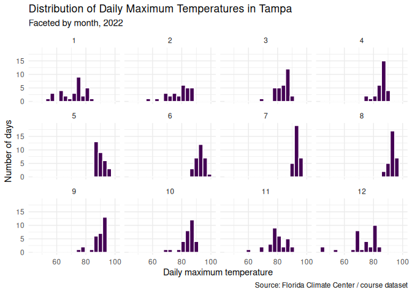

### Interpretation

The faceted histograms show that Tampa's daily maximum temperatures vary across the year. Cooler values appear more frequently in the winter months, while the summer months show a tighter concentration of high temperatures. The monthly layout makes seasonal temperature shifts easier to compare because each month is shown using the same measurement scale.

## 1B. Density Plot of Maximum Temperature by Month


``` r
ggplot(weather_clean, aes(x = max_temp, color = month)) +
  geom_density(kernel = "gaussian", bw = 0.5, linewidth = 0.8) +
  scale_color_viridis_d(option = "D") +
  labs(
    title = "Density of Daily Maximum Temperatures",
    subtitle = "Monthly temperature distributions for Tampa, 2022",
    x = "Daily maximum temperature",
    y = "Density",
    color = "Month",
    caption = "Source: Florida Climate Center / course dataset"
  ) +
  theme_minimal()
```

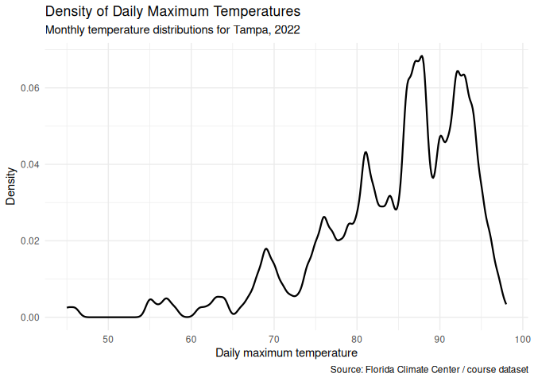

### Interpretation

The density plot emphasizes how the shape of the temperature distribution changes by month. Summer months are concentrated toward warmer daily highs, while winter and early spring months have wider and cooler distributions. Using a density plot helps reveal the full distribution instead of only showing monthly averages.

## 1C. Faceted Density Plot


``` r
ggplot(weather_clean, aes(x = max_temp, fill = month_label)) +
  geom_density(alpha = 0.75) +
  facet_wrap(~ month, ncol = 4) +
  scale_fill_viridis_d(option = "D") +
  labs(
    title = "Monthly Density of Daily Maximum Temperatures",
    subtitle = "Tampa International Airport, 2022",
    x = "Daily maximum temperature",
    y = "Density",
    caption = "Source: Florida Climate Center / course dataset"
  ) +
  theme_minimal() +
  theme(legend.position = "none")
```

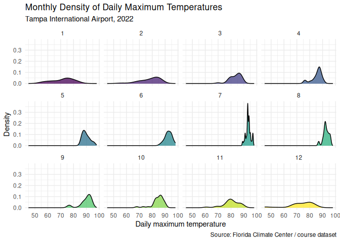

### Interpretation

The faceted density view is easier to read than overlaying every month in one panel. It allows each month to be inspected separately while still keeping a consistent design. This supports comparison without relying only on color, which improves accessibility.

## 1D. Ridgeline Plot of Maximum Temperature


``` r
ggplot(weather_clean, aes(x = max_temp, y = month_label, fill = month_label)) +
  geom_density_ridges(
    quantile_lines = TRUE,
    quantiles = 2,
    scale = 2,
    rel_min_height = 0.01,
    alpha = 0.75
  ) +
  scale_fill_viridis_d(option = "D") +
  labs(
    title = "Ridgeline View of Tampa Maximum Temperatures",
    subtitle = "Monthly distributions with median reference lines",
    x = "Daily maximum temperature",
    y = "Month",
    fill = "Month",
    caption = "Source: Florida Climate Center / course dataset"
  ) +
  theme_minimal() +
  theme(legend.position = "none")
```


### Interpretation

The ridgeline chart gives a compact comparison of monthly temperature distributions. The median lines help the reader compare months without depending only on color. The plot shows a clear seasonal movement from cooler winter temperatures to consistently warmer summer temperatures.

## 1E. Precipitation by Month


``` r
precip_month <- weather_clean %>%
  group_by(month, month_num) %>%
  summarize(total_precipitation = sum(precipitation, na.rm = TRUE), .groups = "drop") %>%
  arrange(month_num)

ggplot(precip_month, aes(x = month, y = total_precipitation, fill = total_precipitation)) +
  geom_col(show.legend = FALSE) +
  scale_fill_viridis_c(option = "C") +
  labs(
    title = "Total Monthly Precipitation in Tampa",
    subtitle = "Monthly totals based on daily precipitation values, 2022",
    x = "Month",
    y = "Total precipitation",
    caption = "Source: Florida Climate Center / course dataset"
  ) +
  theme_minimal()
```

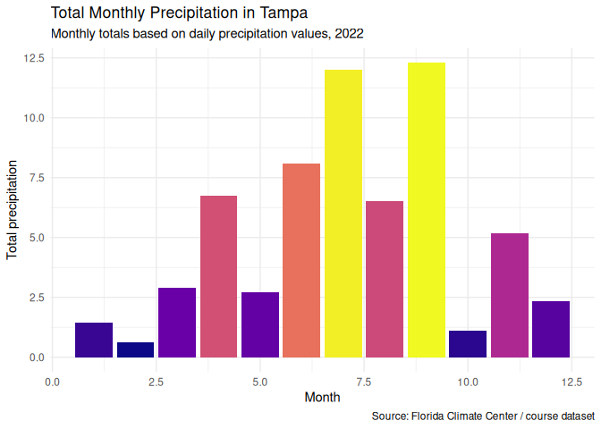

### Interpretation

This chart shows that precipitation is not distributed evenly across the year. Some months receive substantially more rainfall than others, highlighting seasonal variation. This is useful because temperature alone does not describe the full weather pattern.

# Required Interactive Chart

The final project requires at least one interactive visualization. The chart below converts the precipitation chart into a Plotly visualization. The interactivity allows readers to hover over each bar and see the exact monthly precipitation value, which is more precise than reading values from a static axis.


``` r
interactive_precip <- ggplot(
  precip_month,
  aes(
    x = month,
    y = total_precipitation,
    text = paste0(
      "Month: ", month,
      "<br>Total precipitation: ", round(total_precipitation, 2)
    )
  )
) +
  geom_col(fill = viridis(1, option = "C")) +
  labs(
    title = "Interactive Monthly Precipitation in Tampa",
    x = "Month",
    y = "Total precipitation"
  ) +
  theme_minimal()

interactive_precip_plot <- ggplotly(interactive_precip, tooltip = "text")
interactive_precip_plot
```

```{=html}
<div class="plotly html-widget html-fill-item" id="htmlwidget-48951444dca91c464003" style="width:672px;height:480px;"></div>
<script type="application/json" data-for="htmlwidget-48951444dca91c464003">{"x":{"data":[{"orientation":"v","width":[0.89999999999999991,0.90000000000000013,0.90000000000000036,0.90000000000000036,0.90000000000000036,0.90000000000000036,0.90000000000000036,0.89999999999999947,0.89999999999999858,0.89999999999999858,0.89999999999999858,0.89999999999999858],"base":[0,0,0,0,0,0,0,0,0,0,0,0],"x":[1,2,3,4,5,6,7,8,9,10,11,12],"y":[1.46004,0.62002000000000002,2.9100199999999998,6.7600000000000007,2.7100200000000001,8.0700300000000009,11.990029999999999,6.5100499999999997,12.29002,1.1000299999999998,5.18004,2.3500100000000002],"text":["Month: 1<br>Total precipitation: 1.46","Month: 2<br>Total precipitation: 0.62","Month: 3<br>Total precipitation: 2.91","Month: 4<br>Total precipitation: 6.76","Month: 5<br>Total precipitation: 2.71","Month: 6<br>Total precipitation: 8.07","Month: 7<br>Total precipitation: 11.99","Month: 8<br>Total precipitation: 6.51","Month: 9<br>Total precipitation: 12.29","Month: 10<br>Total precipitation: 1.1","Month: 11<br>Total precipitation: 5.18","Month: 12<br>Total precipitation: 2.35"],"type":"bar","textposition":"none","marker":{"autocolorscale":false,"color":"rgba(13,8,135,1)","line":{"width":1.8897637795275593,"color":"transparent"}},"showlegend":false,"xaxis":"x","yaxis":"y","hoverinfo":"text","frame":null}],"layout":{"margin":{"t":40.840182648401829,"r":7.3059360730593621,"b":37.260273972602747,"l":48.949771689497723},"paper_bgcolor":"rgba(255,255,255,1)","font":{"color":"rgba(0,0,0,1)","family":"","size":14.611872146118724},"title":{"text":"Interactive Monthly Precipitation in Tampa","font":{"color":"rgba(0,0,0,1)","family":"","size":17.534246575342465},"x":0,"xref":"paper"},"xaxis":{"domain":[0,1],"automargin":true,"type":"linear","autorange":false,"range":[-0.044999999999999929,13.045],"tickmode":"array","ticktext":["0.0","2.5","5.0","7.5","10.0","12.5"],"tickvals":[0,2.5,5,7.5000000000000009,10,12.5],"categoryorder":"array","categoryarray":["0.0","2.5","5.0","7.5","10.0","12.5"],"nticks":null,"ticks":"","tickcolor":null,"ticklen":3.6529680365296811,"tickwidth":0,"showticklabels":true,"tickfont":{"color":"rgba(77,77,77,1)","family":"","size":11.68949771689498},"tickangle":-0,"showline":false,"linecolor":null,"linewidth":0,"showgrid":true,"gridcolor":"rgba(235,235,235,1)","gridwidth":0.66417600664176002,"zeroline":false,"anchor":"y","title":{"text":"Month","font":{"color":"rgba(0,0,0,1)","family":"","size":14.611872146118724}},"hoverformat":".2f"},"yaxis":{"domain":[0,1],"automargin":true,"type":"linear","autorange":false,"range":[-0.61450100000000007,12.904521000000001],"tickmode":"array","ticktext":["0.0","2.5","5.0","7.5","10.0","12.5"],"tickvals":[0,2.5,5,7.5000000000000009,10,12.5],"categoryorder":"array","categoryarray":["0.0","2.5","5.0","7.5","10.0","12.5"],"nticks":null,"ticks":"","tickcolor":null,"ticklen":3.6529680365296811,"tickwidth":0,"showticklabels":true,"tickfont":{"color":"rgba(77,77,77,1)","family":"","size":11.68949771689498},"tickangle":-0,"showline":false,"linecolor":null,"linewidth":0,"showgrid":true,"gridcolor":"rgba(235,235,235,1)","gridwidth":0.66417600664176002,"zeroline":false,"anchor":"x","title":{"text":"Total precipitation","font":{"color":"rgba(0,0,0,1)","family":"","size":14.611872146118724}},"hoverformat":".2f"},"shapes":[],"showlegend":false,"legend":{"bgcolor":null,"bordercolor":null,"borderwidth":0,"font":{"color":"rgba(0,0,0,1)","family":"","size":11.68949771689498}},"hovermode":"closest","barmode":"relative"},"config":{"doubleClick":"reset","modeBarButtonsToAdd":["hoverclosest","hovercompare"],"showSendToCloud":false},"source":"A","attrs":{"217176fa27a8":{"x":{},"y":{},"text":{},"type":"bar"}},"cur_data":"217176fa27a8","visdat":{"217176fa27a8":["function (y) ","x"]},"highlight":{"on":"plotly_click","persistent":false,"dynamic":false,"selectize":false,"opacityDim":0.20000000000000001,"selected":{"opacity":1},"debounce":0},"shinyEvents":["plotly_hover","plotly_click","plotly_selected","plotly_relayout","plotly_brushed","plotly_brushing","plotly_clickannotation","plotly_doubleclick","plotly_deselect","plotly_afterplot","plotly_sunburstclick"],"base_url":"https://plot.ly"},"evals":[],"jsHooks":[]}</script>
```


``` r
# Optional: uncomment this line if your instructor asks for a separate HTML widget.
# htmlwidgets::saveWidget(interactive_precip_plot, "interactive_precipitation_project_03.html", selfcontained = TRUE)
```

# Spatial Visualization Using Shapefiles

This spatial visualization uses a Florida county boundary shapefile. The shapefile components should be stored in the `data/Florida_Counties/` subfolder. A shapefile requires multiple related files, such as `.shp`, `.shx`, `.dbf`, and `.prj`, to remain together in the same folder.


``` r
county_path_1 <- "data/Florida_Counties/Florida_Counties.shp"
county_path_2 <- "../data/Florida_Counties/Florida_Counties.shp"

if (file.exists(county_path_1)) {
  county_path <- county_path_1
} else if (file.exists(county_path_2)) {
  county_path <- county_path_2
} else {
  stop("Florida_Counties.shp was not found. Place the Florida_Counties shapefile folder inside the data subfolder.")
}

fl_counties <- st_read(county_path, quiet = TRUE)

ggplot(fl_counties) +
  geom_sf(fill = "white", color = "gray50", linewidth = 0.3) +
  labs(
    title = "Spatial Visualization of Florida Counties",
    subtitle = "County boundaries displayed using a shapefile",
    caption = "Source: Florida_Counties shapefile"
  ) +
  theme_minimal()
```

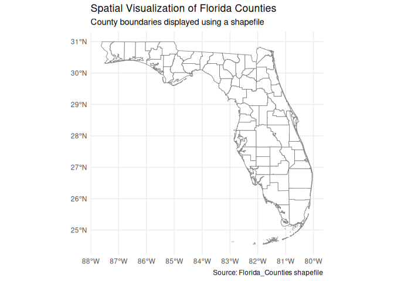

### Spatial Visualization Interpretation

This map demonstrates the use of spatial data in R with the `sf` package. The visualization is intentionally kept static and simple to avoid performance problems in the knitted HTML file. The county boundaries provide geographic context and satisfy the requirement to include a spatial visualization using shapefiles.

# Part 2: Concrete Strength Visualization

For the second part of this project, I selected the concrete strength dataset. This dataset contains quantitative variables related to concrete ingredients, age, and compressive strength.


``` r
concrete_url <- "https://raw.githubusercontent.com/aalhamadani/datasets/master/concrete.csv"

concrete <- read_csv(concrete_url, col_types = cols())

new_concrete <- concrete %>%
  mutate(
    strength_range = cut(
      Concrete_compressive_strength,
      breaks = quantile(
        Concrete_compressive_strength,
        probs = seq(0, 1, 0.2),
        na.rm = TRUE
      ),
      include.lowest = TRUE
    )
  )

glimpse(new_concrete)
```

```
## Rows: 1,030
## Columns: 10
## $ Cement                        <dbl> 540.0, 540.0, 332.5, 332.5, 198.6, 266.0…
## $ Blast_Furnace_Slag            <dbl> 0.0, 0.0, 142.5, 142.5, 132.4, 114.0, 95…
## $ Fly_Ash                       <dbl> 0, 0, 0, 0, 0, 0, 0, 0, 0, 0, 0, 0, 0, 0…
## $ Water                         <dbl> 162, 162, 228, 228, 192, 228, 228, 228, …
## $ Superplasticizer              <dbl> 2.5, 2.5, 0.0, 0.0, 0.0, 0.0, 0.0, 0.0, …
## $ Coarse_Aggregate              <dbl> 1040.0, 1055.0, 932.0, 932.0, 978.4, 932…
## $ Fine_Aggregate                <dbl> 676.0, 676.0, 594.0, 594.0, 825.5, 670.0…
## $ Age                           <dbl> 28, 28, 270, 365, 360, 90, 365, 28, 28, …
## $ Concrete_compressive_strength <dbl> 79.986111, 61.887366, 40.269535, 41.0527…
## $ strength_range                <fct> "(50.5,82.6]", "(50.5,82.6]", "(39,50.5]…
```

## Distribution of Continuous Variables


``` r
ggplot(new_concrete, aes(x = Concrete_compressive_strength)) +
  geom_histogram(binwidth = 5, fill = viridis(1, option = "D"), color = "white") +
  labs(
    title = "Distribution of Concrete Compressive Strength",
    subtitle = "Most observations fall within lower to middle strength ranges",
    x = "Concrete compressive strength",
    y = "Number of observations",
    caption = "Source: UCI concrete strength dataset / course dataset"
  ) +
  theme_minimal()
```

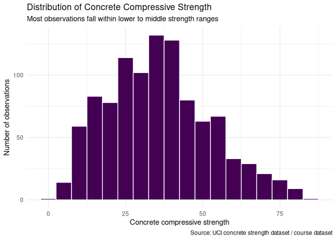


``` r
ggplot(new_concrete, aes(x = Cement)) +
  geom_histogram(binwidth = 25, fill = viridis(1, option = "C"), color = "white") +
  labs(
    title = "Distribution of Cement Amounts",
    subtitle = "Cement content varies widely across concrete mixtures",
    x = "Cement",
    y = "Number of observations",
    caption = "Source: UCI concrete strength dataset / course dataset"
  ) +
  theme_minimal()
```

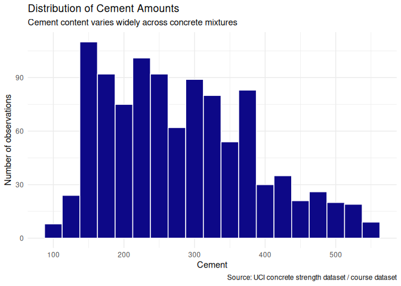

### Interpretation

The distributions show that concrete compressive strength and cement content vary meaningfully across the dataset. The strength distribution is not perfectly symmetric, which suggests that a single average value would not fully describe the data. Cement content also has a broad range, which is useful for studying how ingredient quantities relate to final strength.

## Concrete Strength by Age


``` r
new_concrete %>%
  mutate(Age = factor(Age)) %>%
  ggplot(aes(x = Age, y = Concrete_compressive_strength, fill = Age)) +
  geom_boxplot(show.legend = FALSE, outlier.alpha = 0.35) +
  scale_fill_viridis_d(option = "D") +
  labs(
    title = "Concrete Strength by Age",
    subtitle = "Concrete generally reaches higher strength at older ages",
    x = "Age in days",
    y = "Concrete compressive strength",
    caption = "Source: UCI concrete strength dataset / course dataset"
  ) +
  theme_minimal()
```

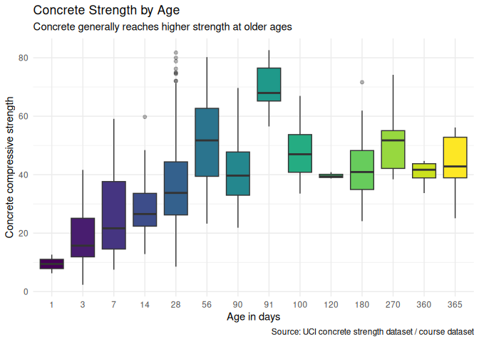

### Interpretation

The boxplot shows that age is an important factor in concrete strength. Older concrete tends to have higher compressive strength, although the spread of values also shows that ingredients and mixture design still matter. This plot supports the idea that concrete strength is related to time as well as material composition.

## Cement and Water Compared with Strength


``` r
ggplot(
  new_concrete,
  aes(
    x = Cement,
    y = Water,
    color = strength_range,
    shape = strength_range
  )
) +
  geom_point(alpha = 0.75, size = 2) +
  scale_color_viridis_d(option = "D") +
  labs(
    title = "Concrete Ingredients and Strength Range",
    subtitle = "Cement and water amounts are compared across strength categories",
    x = "Cement",
    y = "Water",
    color = "Strength range",
    shape = "Strength range",
    caption = "Source: UCI concrete strength dataset / course dataset"
  ) +
  theme_minimal()
```

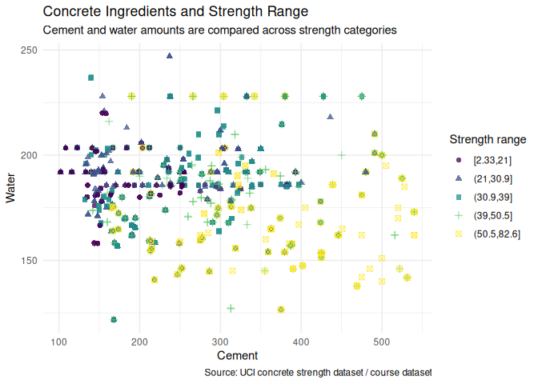

### Interpretation

The scatterplot compares two major mixture ingredients while also showing the strength range. Stronger mixtures often appear where cement content is higher, although the relationship is not perfectly linear. Shape is used along with color so that the grouping does not depend on color alone.

# Bad Chart Redesign: Before and After

The final project also asks for a bad or misleading chart to be redesigned. The first chart below intentionally uses poor design choices: a rainbow palette, angled labels, chartjunk, and no clear message. The redesigned chart uses a cleaner layout, a colorblind-safe palette, sorted categories, and clearer labels.

## Before: Poorly Designed Chart


``` r
bad_precip <- precip_month %>%
  mutate(month = factor(month, levels = sample(month)))

ggplot(bad_precip, aes(x = month, y = total_precipitation, fill = month)) +
  geom_col(color = "black") +
  scale_fill_manual(values = rainbow(nrow(bad_precip))) +
  labs(
    title = "RAIN RAIN RAIN!!!",
    x = "",
    y = "",
    fill = "Months"
  ) +
  theme(
    panel.background = element_rect(fill = "gray90"),
    axis.text.x = element_text(angle = 60, hjust = 1),
    legend.position = "bottom"
  )
```

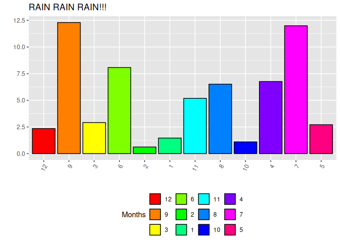

## After: Improved Chart


``` r
ggplot(precip_month, aes(x = month, y = total_precipitation, fill = total_precipitation)) +
  geom_col(show.legend = FALSE) +
  scale_fill_viridis_c(option = "C") +
  labs(
    title = "Monthly Precipitation in Tampa, 2022",
    subtitle = "Calendar order and a simpler design make the pattern easier to read",
    x = "Month",
    y = "Total precipitation",
    caption = "Source: Florida Climate Center / course dataset"
  ) +
  theme_minimal()
```

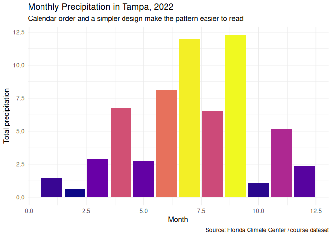

### Redesign Explanation

The original chart was difficult to interpret because it used a rainbow palette, unnecessary visual decoration, unsorted categories, and unclear labeling. The redesigned chart improves the visualization by placing months in calendar order, using a colorblind-safe palette, removing unnecessary chartjunk, and adding a clear title, subtitle, axis labels, and source caption. These changes make the pattern easier to understand and more accessible.

# Accessibility Notes

This project follows accessibility guidelines in several ways. The charts use viridis or neutral color palettes that are more readable for users with color vision differences. Each figure includes descriptive `fig.alt` text. The scatterplot uses both color and shape so that categories are not communicated by color alone. Labels, titles, and captions are written to make the purpose of each chart clear.

# Conclusion

Project 03 extends the final portfolio by demonstrating several visualization techniques, including histograms, density plots, ridgeline plots, spatial mapping, interactive visualization, and chart redesign. The Tampa weather data shows seasonal variation in temperature and precipitation, while the concrete dataset demonstrates how distributions and relationships can be explored using multiple chart types. The spatial map shows the ability to work with shapefiles, and the before/after redesign demonstrates how design choices affect readability. Together, these sections show how data visualization can support exploration, comparison, interpretation, and communication.
